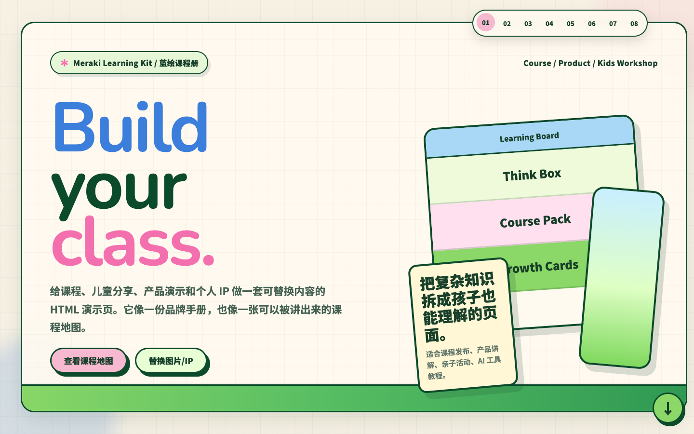

# XiaoShui Pretty PPT

把飞书文档、文章、笔记、教程、汇报和作品集，变成可以直接打开、演示、编辑和发布的 **HTML 网页 PPT**。

这不是普通网页模板，也不是图片式 AI PPT。它的重点是把内容变成一套可继续迭代的 presentation workflow：

- 中文文字清晰，不是放大就糊的截图。
- 生成后仍可按 `E` 进入浏览器编辑模式，直接改文字、调字号并导出 HTML。
- 可按 `P` 打开演讲者模式，查看讲稿备注、下一页预览和计时器。
- 13 套模板按场景选择，适合自媒体、个人展示、作品集、课程产品、行政政务、职场汇报和产品演讲。
- 交付物是静态 HTML 文件夹，可以本地打开，也可以部署到 GitHub Pages、Cloudflare Workers 或任意静态托管。

## Demo

推荐先看粉白时尚风的动态介绍页：

[docs/demo/blush-skill-intro/index.html](docs/demo/blush-skill-intro/index.html)

第 13 个模板 **Meraki Learning Kit / 蓝绘课程册** 目前提供截图预览：

[assets/previews/template-13-meraki-learning-kit.png](assets/previews/template-13-meraki-learning-kit.png)

本地生成可交互预览：

```bash
python3 skills/xiaoshui-pretty-ppt/scripts/copy_template.py meraki-learning-kit /tmp/xiaoshui-meraki-preview --force
open /tmp/xiaoshui-meraki-preview/index.html
```

打开后可以试两个快捷键：

- `P`：演讲者模式，显示讲稿备注、下一页预览、计时器。
- `E`：进入编辑模式，可以直接编辑页面文字、调整字号、替换图片/视频、导出 HTML。

演讲者模式说明：

- 正常 PPT 页面不会显示 `.speaker-notes` 小抄内容。
- 按 `P` 后，小抄会显示在当前浏览器窗口的右侧面板。
- 如果你把这个 presenter 窗口共享给观众，观众也会看到小抄。
- 要保证观众看不到，请共享普通 PPT 窗口，把按 `P` 的 presenter 窗口放在自己的屏幕或另一个未共享窗口里。
- presenter 面板里的 Speaker Notes 可以直接编辑，编辑内容会同步回当前页隐藏 notes。

## Why HTML Web PPT

很多 AI PPT 工具能生成漂亮画面，但真实使用时会遇到几个问题：

- 生成结果偏图片，中文容易糊，文字难以修改。
- 模板效果不稳定，每次像抽卡。
- 文档、PPT、网页和分享链接是割裂的，内容改动后要反复重排。
- 很多工具只解决“做出一页”，没有解决“拿去演示、复盘、发布、二次修改”。

xiaoshui-Pretty PPT 的做法是：先把文档拆成演示结构，再用真实 HTML 模板生成一套可以打开、演讲、编辑、发布的网页 PPT。

## Template Modules

当前内置 13 套视觉模板，分为两个模块。

## Module A · 自媒体 / 个人展示 / 作品集

适合更活泼、更有记忆点、更适合对外分享的内容。

- **Pastel Blockfolio / 粉彩拼贴志**：教程、案例、流程复盘、自媒体选题说明。
- **Blush Editorial / 暖粉编辑志**：品牌内容页、推荐清单、工具目录、编辑感长页面。
- **Mono Curve Slides / 墨线白稿**：动态幻灯片、课程说明、产品更新、轻量演示页。
- **Ribbon Tab Brochure / 彩签页报**：项目资料册、产品说明、运营复盘、对外提案。
- **Blue Growth Deck / 蓝色增长稿**：AI 产品、运营增长、GEO 复盘、轻商务互动演示。
- **Garden Pop Landing / 花园跳色长页**：自媒体教程、课程产品、创作者产品发布、轻快产品长页。
- **Meraki Learning Kit / 蓝绘课程册**：课程产品、儿童友好科普、创作者产品 Demo、学习地图、个人 IP 介绍。

## Module B · 行政政务 / 职场汇报 / 产品演讲

适合更实用、更正式、更偏工作交付的演示场景。

- **One Dot Cinnabar / 一点丹红**：年终总结、工作汇报、项目复盘、正式演讲。
- **Ivory Research Deck / 象牙研稿**：学术汇报、研究总结、职场简报、产品调研。
- **Cobalt Executive Deck / 钴蓝商策**：商务汇报、产品介绍、公司介绍、合作提案。
- **Coral Startup Deck / 珊瑚企简**：公司介绍、项目汇报、团队路演、工作计划。
- **Sapphire Defense Deck / 宝蓝答辩稿**：论文答辩、学术汇报、研究总结、正式项目复盘。
- **Vermilion Civic Deck / 红色汇报稿**：政务工作、行政汇报、党建材料、公共服务项目总结。

## Preview Gallery

### 01. Pastel Blockfolio / 粉彩拼贴志

适合把一个操作过程、案例复盘、前后对比教程做成有视觉记忆点的图文演示。


### 02. Blush Editorial / 暖粉编辑志

适合品牌感、编辑感更强的内容页面，比如工具推荐、清单整理、内容目录、产品介绍。


### 03. Mono Curve Slides / 墨线白稿

适合像 PPT 一样讲内容：上方可以做卡片预览，点开后进入独立幻灯片页面。


### 04. One Dot Cinnabar / 一点丹红

适合正式场合的汇报页面，比如年终总结、项目复盘、领导汇报、部门工作汇报。


### 05. Ivory Research Deck / 象牙研稿

适合学术、研究和正式汇报场景：用象牙白纸面、浅蓝信息块、细线表格和时间轴承载高密度内容。


### 06. Cobalt Executive Deck / 钴蓝商策

适合商务汇报、产品介绍、公司介绍和合作提案。


### 07. Coral Startup Deck / 珊瑚企简

适合更温暖、更有亲和力的公司介绍、项目汇报、团队路演和工作计划。


### 08. Ribbon Tab Brochure / 彩签页报

适合全屏项目资料册、产品说明、运营复盘和对外提案。


### 09. Sapphire Defense Deck / 宝蓝答辩稿

适合论文答辩、研究汇报和正式项目复盘。


### 10. Vermilion Civic Deck / 红色汇报稿

适合政务、行政、党建和公共服务类正式汇报。


### 11. Blue Growth Deck / 蓝色增长稿

适合 AI 产品、运营增长、GEO 复盘和轻商务互动演示。


### 12. Garden Pop Landing / 花园跳色长页

适合自媒体教程、课程产品、创作者发布和轻快产品长页。


### 13. Meraki Learning Kit / 蓝绘课程册

适合课程产品、儿童友好科普、创作者产品 Demo、学习地图和个人 IP 介绍。



## What It Can Do

XiaoShui Pretty PPT 可以帮助 Coding Agent：

- 读取用户提供的文字、Markdown、飞书文档内容、图片、截图、视频素材。
- 在动手前判断 PPT 的使用场景、受众、内容密度和模板方向。
- 判断内容更适合哪一种 PPT 模板。
- 把长文档拆成 cover、agenda、chapter、data、process、comparison、image、summary、closing 等演示页。
- 生成可以直接打开的静态 HTML 网页 PPT，默认内置浏览器编辑模式和演讲者模式。
- 保留每套模板自己的配色、字体层级、版式节奏和交互动效。
- 根据内容长度决定应该做成几页，而不是把所有内容硬塞进一屏。
- 主动询问最多 3 个问题，再推荐 2-3 套模板，而不是让用户自己翻完整模板库。
- 将文档内容分成页面展示、讲稿备注、附录/来源链接、可省略内容。
- 如果用户提供飞书链接并具备飞书 CLI/文档访问能力，可以在页面里保留跳回飞书原文或具体模块的链接。
- 默认内置浏览器编辑模式：按 `E` 直接改任何文字、调整字号、替换图片/视频、插入新图片，保存到本机或导出修改后的 HTML。
- 默认内置演讲者模式：按 `P` 查看讲稿备注、下一页预览、计时器。

## What Makes It Different

XiaoShui Pretty PPT 的独特之处：

- **模板驱动**：不是从零生成代码，而是从 13 套精心设计的视觉模板出发，保持每组配色、字体层级和交互动画的一致性。
- **先判断再动手**：在使用前会先了解场景、受众、内容密度和素材情况，再推荐最合适的模板方向。
- **主动交互**：如果用户只说“帮我做 PPT”，Skill 会先问场景、密度、素材三件事，再推荐模板并要求用户发送内容。
- **渐进式交付**：清晰的工作流 — 判断模式 → 内容摄入 → 选择模板 → 规划页面 → 复制模板 → 填充内容 → 质量验收 → 交付。
- **可编辑交付物**：生成的 HTML PPT 默认内置编辑工具栏，按 `E` 即可编辑所有文字、调整字号、替换图片/视频、插入新图片，按 `Cmd+S` 保存，点「导出 HTML」下载独立文件。
- **演讲者模式**：按 `P` 可以打开讲稿备注、下一页预览和计时器，适合录课、分享会和产品演示。
- **内容压缩**：不是把文档逐段贴进页面，而是将素材分类为"页面展示/讲稿备注/附录或来源链接/可省略/需要可视化"再规划页面。
- **来源追溯**：需要时可以在卡片、附录或讲稿备注里保留飞书原文链接；公开发布前应去掉私有飞书链接。

## Before Creating A PPT

如果用户只给一个主题，skill 会先判断几个维度：

| 维度 | 要判断什么 |
|---|---|
| 使用场景 | 现场演讲、对外分享、内部汇报、产品路演、课程教程、作品集展示 |
| 受众 | 领导、同事、客户、学生、公开观众、专业评审 |
| 内容密度 | 少字演讲型、图文均衡型、高密度报告型、教程走查型 |
| 素材状态 | 完整文档、粗略笔记、只有主题、截图/图片/旧 PPT 是否齐全 |
| 模板方向 | 自媒体/个人展示/作品集，还是行政政务/职场汇报/产品演讲 |

默认只问 3 个关键问题：

1. 这个 PPT 给谁看、用在什么场景？
2. 内容要少一点适合演讲，还是多一点适合阅读/汇报？
3. 你有文档、截图、图片、数据或旧 PPT 吗？

拿到回答后，只推荐 2-3 个模板，并主动要求用户继续发送内容：

```text
我建议优先看 Blush Editorial、Mono Curve Slides、Cobalt Executive Deck。
如果要更正式，我会选 Cobalt；如果要更有传播感，我会选 Blush。
接下来把飞书文档链接、文章、截图、数据表或旧 PPT 发给我，我先做页面结构图，再生成 HTML PPT。
```

内容密度默认分四档：

| 密度 | 适合 | 页面规则 |
|---|---|---|
| Speaker Deck | 现场演讲、分享会、发布 | 一页一个观点，少字，强视觉 |
| Share Deck | 既演讲也发给别人看 | 3-5 个要点，图文均衡 |
| Report Deck | 行政、政务、职场、研究 | 可放表格/卡片/KPI，但必须分组，不堆长段落 |
| Tutorial / Portfolio | 教程、案例、作品集 | 以步骤、截图、案例前后对比为主 |

内容会被分到四个位置：

| 位置 | 放什么 |
|---|---|
| 页面展示 | 核心结论、关键数据、框架、流程、案例、截图、重要引用 |
| 讲稿备注 | 背景解释、过渡话术、补充案例、风险提醒、长解释 |
| 附录/来源链接 | 完整表格、长引用、飞书原文、政策/会议纪要等来源 |
| 省略 | 重复背景、泛泛介绍、弱例子、和目标无关的细节 |

如果需要从 PPT 跳回飞书文档，需要满足两个前提：

- 用户或 Agent 能访问该飞书文档，必要时安装并登录飞书 CLI。
- 不把私有飞书链接放进公开发布的 HTML，除非用户明确允许。

## How To Use

在 Codex 里可以这样调用：

```text
使用 $xiaoshui-pretty-ppt，把这份文档做成一个适合晚上分享的 HTML 网页 PPT。
请根据内容自动选择最合适的模板。
请保留默认开启的可编辑模式和演讲者模式。
```

指定模板：

```text
使用 $xiaoshui-pretty-ppt 的 Cobalt Executive Deck / 钴蓝商策，
把这份产品介绍做成商务汇报型网页 PPT。
请保留默认可编辑模式。
```

从飞书文档生成适合对外分享的网页 PPT：

```text
使用 $xiaoshui-pretty-ppt，把这个飞书文档做成一份适合对外分享的 HTML 网页 PPT。
要求：
1. 先判断内容更适合哪一套模板；
2. 把长文档拆成封面、钩子、核心观点、案例、流程、总结；
3. 保留默认可编辑模式，方便我录视频时展示生成后还能改；
4. 保留默认演讲者模式，把长解释放进讲稿备注；
5. 最后告诉我本地 HTML 路径和如何打开。
```

复制模板到本地输出目录（默认内置编辑模式和演讲者模式）：

```bash
python3 skills/xiaoshui-pretty-ppt/scripts/copy_template.py cobalt-executive-deck /tmp/shui-cobalt-demo --force
open /tmp/shui-cobalt-demo/index.html
```

生成不带编辑工具栏的纯净版（仍保留演讲者模式）：

```bash
python3 skills/xiaoshui-pretty-ppt/scripts/copy_template.py cobalt-executive-deck /tmp/shui-cobalt-demo --force --no-edit
open /tmp/shui-cobalt-demo/index.html
```

生成不带演讲者模式的纯净版（仍保留编辑模式）：

```bash
python3 skills/xiaoshui-pretty-ppt/scripts/copy_template.py blush-editorial /tmp/shui-blush-demo --force --no-presenter
open /tmp/shui-blush-demo/index.html
```

给已有 HTML PPT 注入编辑模式：

```bash
python3 skills/xiaoshui-pretty-ppt/scripts/inject_edit_mode.py /tmp/shui-cobalt-demo/index.html
```

给已有 HTML PPT 注入演讲者模式：

```bash
python3 skills/xiaoshui-pretty-ppt/scripts/inject_presenter_mode.py /tmp/shui-blush-demo/index.html
```

打开后右上角会出现编辑工具栏：按 `E` 进入编辑模式，直接点任何文字即可修改；点选文字后可用「字号 / A- / A+ / 默认」调整字体大小；点图片/视频上的「替换图片」「替换视频」可换 URL 或上传本地文件；点「➕ 插入图片」可以往页面里新增图片；按 `Cmd+S` / `Ctrl+S` 保存到本机；点「导出 HTML」下载修改后的独立文件；点「重置」清除本地修改恢复模板内容。

打开后按 `P` 进入演讲者模式，可看到当前页摘要、下一页标题、讲稿备注和计时器；按 `Esc` 退出。

验证输出：

```bash
python3 skills/xiaoshui-pretty-ppt/scripts/validate_deck.py /tmp/shui-cobalt-demo
```

验证全部模板默认都有编辑模式和演讲者模式：

```bash
python3 skills/xiaoshui-pretty-ppt/scripts/validate_template_library.py
```

## Public Showcase And Private Source

如果不希望完整模板源码公开，推荐拆成两层：

| 层级 | 放什么 | 建议位置 |
|---|---|---|
| 公开展示 | README、截图、GIF/视频、少量脱敏 demo、安装/联系说明 | GitHub public showcase 仓库或公开 Pages |
| 私有源码 | `skills/`、完整模板 HTML、运行脚本、未公开模板 | GitHub private 仓库，同时本地保留一份 |

只放在本地最安全，但不方便跨设备和版本管理；放在 GitHub private 仓库更适合长期维护、回滚和授权安装。公开 HTML demo 本身无法隐藏前端代码，所以公开 demo 只放可以被别人看到的样式和脱敏内容。

## Install

### Install from GitHub

推荐使用 `skills` CLI：

```bash
npx -y skills@latest add XshuiAi/xiaoshui-pretty-ppt \
  --skill xiaoshui-pretty-ppt \
  --agent codex \
  --global
```

如果希望复制文件而不是软链接：

```bash
npx -y skills@latest add XshuiAi/xiaoshui-pretty-ppt \
  --skill xiaoshui-pretty-ppt \
  --agent codex \
  --global \
  --copy \
  -y
```

### Manual install for Codex

复制 skill 目录到 Codex skills 目录：

```bash
mkdir -p ~/.codex/skills
cp -R skills/xiaoshui-pretty-ppt ~/.codex/skills/xiaoshui-pretty-ppt
```

然后重启 Codex，让新 skill 生效。

### Verify Install

检查是否安装成功：

```bash
npx -y skills@latest list --global --agent codex --json
test -f ~/.agents/skills/xiaoshui-pretty-ppt/SKILL.md
```

## Local Sync Workflow

从现在开始，`xiaoshui-pretty-ppt` 是唯一主仓库。旧的 `shui-pretty-html` 文件夹只作为历史备份，不再作为模板更新源。

本地开发后，把仓库里的 skill 同步到 Codex 本机安装目录：

```bash
./scripts/sync-local-skill.sh
```

以后从 GitHub 获取新版本并同步到本机：

```bash
cd /Users/wangduoduo/Desktop/shui-pretty-ppt
./scripts/update-from-github.sh
```

同步目标：

```text
~/.agents/skills/xiaoshui-pretty-ppt
```

## Repository Structure

```text
xiaoshui-pretty-ppt/
├── README.md
├── assets/
│   └── previews/                    # README preview images
├── docs/
│   └── demo/blush-skill-intro/      # 粉白时尚风动态技能介绍页
├── scripts/
│   ├── sync-local-skill.sh          # 同步本仓库 skill 到本机 Codex
│   └── update-from-github.sh        # 拉取 GitHub 最新版本并同步本机
└── skills/
    └── xiaoshui-pretty-ppt/         # Codex skill source
        ├── SKILL.md
        ├── agents/openai.yaml
        ├── references/
        │   ├── intake-and-density.md
        │   ├── ppt-template-catalog.md
        │   ├── quality-checklist.md
        │   ├── editable-delivery.md
        │   ├── workflow-and-install.md
        │   ├── style-index.md
        │   └── *.md                 # detailed style specs
        ├── scripts/
        │   ├── copy_template.py
        │   ├── inject_edit_mode.py
        │   ├── inject_presenter_mode.py
        │   └── validate_deck.py
        ├── runtime/
        │   └── presenter-mode.js
        └── assets/templates/        # reusable HTML PPT template sources
```

## Design Principle

- 每个模板都是独立可运行的完整 HTML 页面，复制即用，不需要从零开始生成。
- 模板之间有明确的视觉差异，确保每套 PPT 风格都有自己的辨识度。
- 所有生成逻辑都基于真实的模板源文件，保证产出质量稳定。
- `SKILL.md` 只保留核心工作流和风格选择规则。
- `references/intake-and-density.md` 负责用户使用前的提问、内容密度和文档压缩。
- `references/ppt-template-catalog.md` 负责模板分类和选择。
- `references/quality-checklist.md` 负责交付前验收。
- 每个模板的详细设计规范放在 `references/`。
- 可复用 HTML 源文件放在 `assets/templates/`。
- 演示增强能力放在 `runtime/`，当前包含演讲者模式。
- 复制模板使用脚本完成，避免每次都让模型从零重写。

## Roadmap

当前优先把 HTML 网页 PPT 这个形态做深，再考虑拆出真正的 PPT 文件或飞书画板技能。

- **Presenter Mode**：已加入基础版，支持讲稿备注、下一页预览、计时器。
- **Nested Slides**：后续增加横向主线 + 纵向详情，适合课程、长报告和产品说明。
- **Auto Animate**：后续增加跨页元素过渡，让重点卡片、数据和截图在页面之间自然移动。
- **Data Report Deck**：加强数据汇报模板，支持 KPI、趋势、漏斗、对比、结论页。
- **Cinematic Portfolio Deck**：增加电影播放感作品集模板，用全屏镜头、章节字幕和滚动叙事做高级展示。
- **Mobile / Vertical Deck**：为自媒体场景补充横屏、竖屏和手机浏览适配策略。
